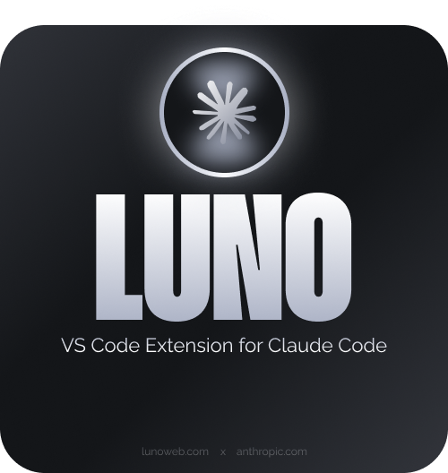

<p align="center">
  
</p>

<p align="center"><strong>Agentic AI coding assistant for Cursor and VS Code — powered by your Claude Code subscription.</strong></p>

<p align="center">
  <a href="LICENSE"></a>
  
  
</p>

<p align="center">
  <a href="https://github.com/oldmilky/luno-for-cc/issues">Issues</a> ·
  <a href="#getting-started">Getting started</a> ·
  <a href="#how-it-works">How it works</a>
</p>

LUNO brings the full Claude Code agent into a native editor side panel: streaming chat, multi-file edits with inline diff previews, terminal execution under a permission gate, plan-mode review with inline comments, and the Claude Code Skills marketplace — all driven by your existing **Claude.ai Pro / Team / Enterprise** subscription. No per-token billing, no separate API key.

**Not on the VS Code Marketplace or Open VSX, by choice.** Build the VSIX from this repo and install it — see [Getting started](#getting-started). There is no monetization and no telemetry.

---

## Highlights

- 🔐 **Subscription-powered.** One-click browser sign-in; credentials live in the OS keychain. No API key file on disk.
- 💬 **Native side-panel chat.** Streaming responses, slash commands, `@`-mention files, Cmd+U to send a selection, Cmd+Shift+I to toggle.
- 🛡️ **Risk-aware approvals.** Five modes — `Ask`, `Edits`, `Agent`, `Plan`, and `Bypass`. Every gated action shows an inline card with a live diff / command preview before it runs. In `Ask`, `Agent` and `Plan`, **destructive** (`rm`, `sudo`, force-push) and **network** (`curl`, `ssh`, `git push`) commands always prompt — never auto-run. `Bypass` turns the gate off entirely; it asks for confirmation once and then colours the toolbar red for as long as it is on.
- 📝 **Plan-mode review.** Pop the plan into its own editor tab, leave inline comments on individual steps, and ship the revised plan back to the agent in one click.
- 🧠 **Project conventions.** Reads `CLAUDE.md` / `AGENTS.md` automatically; one-click "Generate CLAUDE.md" to bootstrap a new repo.
- 🧩 **Skills marketplace.** Browse and install any skill from [claude-plugins.dev](https://claude-plugins.dev) directly from the panel.
- 🔌 **MCP connectors.** Browse and connect remote MCP servers — Linear, Notion, Atlassian, Sentry and more — over OAuth, straight from the panel.
- 🕰 **Checkpoints + rewind.** Every assistant turn snapshots edited files so you can roll back without leaving the chat.
- 📦 **Runs your own CLI.** No bundled copy: LUNO finds the `claude` binary on your
  PATH (or in the standard install locations) and drives that. The VSIX is 605 kB,
  and model aliases resolve against whatever your CLI knows — a self-updating
  install picks up new models with no LUNO release.
- 🎨 **Seven palettes.** copper, purple, red, blue, green, pink, white — every
  surface, border, glow and syntax color derives from 15 tokens per theme, swapped
  live from the header. No hard-coded colors anywhere in the UI.

---

## Getting started

### 0. Prerequisite — the Claude Code CLI

LUNO ships no CLI; it drives yours. Install [Claude Code](https://docs.claude.com/en/docs/claude-code/overview)
and sign in to it once. LUNO then finds the binary on `PATH` or in the standard
install locations, so there is normally nothing to configure.

### 1. Build and install

The toolchain is [bun](https://bun.sh). Works the same in Cursor, VS Code,
VSCodium and Windsurf — substitute your editor's CLI for `cursor`.

```bash
git clone https://github.com/oldmilky/luno-for-cc.git
cd luno-for-cc
bun run install:all      # root + webview
bun run build            # esbuild + vite
bun run package          # → luno-for-cc-<version>.vsix
cursor --install-extension luno-for-cc-<version>.vsix
```

Then **Ctrl+Shift+P → Developer: Reload Window**.

### 2. Sign in

Open the Luno side panel (the LUNO mark in the activity bar) and follow the welcome screen's **Sign in** prompt. Luno launches a secure browser-based sign-in for your Claude.ai subscription — approve the request, and you're returned to VS Code ready to chat.

<!-- Screenshots were removed rather than re-shot: the visual layer is done but the
     functional layer is being rewritten, and a UI about to change would only have
     to be photographed twice. They come back after that work. -->

Token storage:

- Anthropic API keys → VS Code **SecretStorage** (OS keychain).
- Claude.ai subscription → Claude Code's own credential store (`~/.claude/.credentials.json` on Linux, Keychain on macOS).

Luno **never writes to `~/.claude/`** itself — only the `claude` CLI does, on your behalf.

### 3. Start a chat

Open any workspace and pick a starter, or just type. `@` mentions a file, drag-drop pastes file paths, screenshots paste as image attachments.

---

## Permissions & approvals

Cycle modes with **Shift+Tab** (when chat is focused) or the **Luno: Cycle Permission Mode** command.

| Mode                | Runs without asking                                                               | Prompts you                            |
| ------------------- | --------------------------------------------------------------------------------- | -------------------------------------- |
| **Ask** _(default)_ | Read-only tools (`Read`, `Grep`, `Glob`)                                          | Every edit, write, and command         |
| **Edits**           | Reads **+** file edits (`Edit` / `Write` / `MultiEdit` / `NotebookEdit`)          | Every command, delete and network call |
| **Agent**           | Whatever Claude Code's own safety classifier clears, having read the conversation | Anything it will not judge             |
| **Plan**            | Read-only reasoning — nothing executes                                            | — (review the plan, then **Proceed**)  |
| **Bypass**          | Everything, immediately — the gate is off                                         | Nothing                                |

**Always gated in `Ask`, `Edits` and `Plan` — even if allow-listed:**

- 🔴 **Destructive** — `rm`, `rmdir`, `sudo`, `dd`, `mkfs`, `git reset --hard`, `git push --force`, `chmod -R`, `kill -9`, fork bombs, and piping a remote script to a shell (`curl … | bash`).
- 🌐 **Network / external** — `curl`, `wget`, `ssh`, `scp`, `rsync`, `nc`, `git push` / `pull` / `clone`, and web-fetch tools.

`Agent` judges differently, and more thoroughly: rather than matching a list, it
hands each call to Claude Code's own classifier, which reads what you asked for
before deciding. A delete you asked for goes through; one you did not is
refused, and the card says so in amber rather than red — nothing failed, a
decision was made. Where that classifier is unavailable, `Agent` falls back to
the list above.

> The agent is also instructed to avoid touching `.git`, `.env*`, `.ssh`, and shell rc files. Connected MCP-server tools are pre-approved (connecting is the consent step).

> ⚠️ **`Bypass` is the one exception, and it is total.** Nothing in the table above applies: every tool call runs the moment the model emits it, including `rm -rf` and `git push --force`. Only the model's own judgement remains, so Luno makes it deliberate — the mode is absent from the `Shift+Tab` cycle, selecting it requires confirming a modal, and while it is active the composer's mode button stays red. Use it for a sandbox or a throwaway branch, not a repository you cannot restore.

### The approval card

When an action needs your OK, an inline card slides in above the composer with a preview of exactly what will happen:

- **File edits** → a Cursor-style inline diff.
- **Commands** → the exact shell line, in a terminal block.
- **Other tools** → the proposed inputs.

Choose **Allow** (`↵`), **Deny** (`Esc`), or — for edits — **Allow this turn** (`⇧↵`) to stop being re-asked about edits for the rest of the turn. Destructive cards turn **red**, default focus to **Deny**, and require an explicit _"Allow anyway"_; network cards are flagged **amber**. "Allow this turn" only auto-accepts _edits_ — it never disables the destructive/network gate.

---

## Skills

Skills extend the agent with reusable, scoped capabilities — built-ins, Claude Code agent tools, and any project- or user-scoped skills you've installed. Browse and install from **claude-plugins.dev** without leaving the panel.

Install scope is per-skill:

- **Project** → `.claude/skills/<name>/` (committed with your repo)
- **User** → `~/.claude/skills/<name>/` (available everywhere)

---

## Connectors (MCP)

Connect remote **MCP servers** — Linear, Notion, Atlassian, Asana, Intercom, Sentry, PayPal, HubSpot, or any custom endpoint — over OAuth without leaving the panel. The agent can then read and act on that data as part of a chat.

---

## Chat in action

- **`@filename`** inserts a file mention; the contents are sent to the model when relevant.
- **Cmd+U** with a selection sends the highlighted code straight into the composer.
- **Screenshots** paste as image attachments — useful for explaining UI bugs.
- **Slash commands** in the composer trigger built-in workflows or installed skill commands.
- **Chat history** — browse and resume any past session from the history drawer.

---

## Project conventions

Luno looks for `CLAUDE.md` (or `AGENTS.md`) at your workspace root and injects it into every system prompt. If neither exists, the **Generate** action analyzes your repo and writes one for you.

Edited files appear as a collapsible card under the assistant turn with line-add / line-remove counts and an **Undo** button that restores the pre-turn snapshot.

---

## Commands

| Command                      | Default keybinding                    |
| ---------------------------- | ------------------------------------- |
| Luno: New Chat               | —                                     |
| Luno: Toggle Chat Panel      | `Cmd/Ctrl+Shift+I`                    |
| Luno: Cycle Permission Mode  | `Shift+Tab` _(chat focused)_          |
| Luno: Send Selection to Chat | `Cmd/Ctrl+U` _(editor has selection)_ |
| Luno: Comment on Selection   | _(editor context menu)_               |
| Luno: Generate CLAUDE.md     | —                                     |
| Luno: Open Connectors        | —                                     |

---

## Settings

| Setting                    | Default                                                           | Description                                                                                                                                                                                                                                              |
| -------------------------- | ----------------------------------------------------------------- | -------------------------------------------------------------------------------------------------------------------------------------------------------------------------------------------------------------------------------------------------------- |
| `luno.model`               | `default`                                                         | Model alias (`sonnet`, `opus`, `haiku`, `opusplan`, `default`) or explicit version. `default` always tracks the latest. Set from the composer's model picker.                                                                                            |
| `luno.permissionMode`      | `default`                                                         | `default` (Ask) / `auto` (Agent) / `plan`.                                                                                                                                                                                                               |
| `luno.effort`              | `high`                                                            | Reasoning effort: `low` / `medium` / `high` / `xhigh` / `max`.                                                                                                                                                                                           |
| `luno.thinking`            | `true`                                                            | Extended thinking — reason step-by-step before answering.                                                                                                                                                                                                |
| `luno.maxTokens`           | `0`                                                               | Max output tokens per assistant turn, passed as `CLAUDE_CODE_MAX_OUTPUT_TOKENS`. `0` leaves the CLI's own default alone.                                                                                                                                 |
| `luno.worktree`            | `tabs`                                                            | Whether a chat gets its own git worktree, so parallel chats cannot collide. `off` / `tabs` / `always`.                                                                                                                                                   |
| `luno.allowedBashPatterns` | `["^git (status\|diff\|log\|branch)$", "^npm (test\|run test)$"]` | Regex allowlist for commands that auto-run in **Agent** mode. Destructive / network commands are **never** auto-run, even if matched.                                                                                                                    |
| `luno.claudeBinaryPath`    | `""`                                                              | Absolute path to the `claude` binary. Empty → auto-detect from PATH and the standard install locations (`~/.claude/local`, npm global, Homebrew). Set it only to pin a specific install; on Windows point it at `claude.exe`, not the `claude.cmd` shim. |

### What each turn carries

| Setting                  | Default | Description                                                                                                               |
| ------------------------ | ------- | ------------------------------------------------------------------------------------------------------------------------- |
| `luno.autosave`          | `true`  | Save modified editors before each turn. The CLI reads from disk, so an unsaved buffer means the agent works on stale text |
| `luno.sendEditorContext` | `true`  | Include the open file and any selection, so "why does this crash?" has something to point at                              |
| `luno.sendDiagnostics`   | `true`  | Include the editor's Problems, so the agent sees the same errors you do                                                   |
| `luno.terminalCapture`   | `true`  | Keep the last command's output per terminal, so `@terminal:` can put it in a prompt                                       |
| `luno.respectGitIgnore`  | `true`  | Use the repository's own ignore rules when listing files for `@`-mentions                                                 |

### Composer and empty state

| Setting                   | Default | Description                                                                                                                                           |
| ------------------------- | ------- | ----------------------------------------------------------------------------------------------------------------------------------------------------- |
| `luno.useCtrlEnterToSend` | `false` | Require Ctrl/Cmd+Enter to send, leaving plain Enter for a newline                                                                                     |
| `luno.startupSuggestions` | `[]`    | The cards offered on an empty chat, in order. An entry starting with `/` names a skill or command. Empty → the skills and commands actually installed |

### Development only

| Setting               | Default | Description                                                                                       |
| --------------------- | ------- | ------------------------------------------------------------------------------------------------- |
| `luno.devServerUrl`   | `""`    | Point at a running `bun run dev:webview` and the panel loads from it, hot-reloading webview edits |
| `luno.devAutoRestart` | `true`  | In an Extension Development Host, restart the host when `dist/extension.js` is rewritten          |

---

## How it works

```
extension.ts
    │
    ▼
ChatPanelProvider ──── postMessage ────▶  React webview (chat / plan / approval UI)
    │     ▲                                          │
    │     └──────── permissionResponse ──────────────┘
    ▼
Orchestrator (per-turn driver)
    ├─ ClaudeCliProvider   bridges your `claude` CLI over stream-json and
    │                      routes the CLI's `can_use_tool` requests back to you
    │                      via `--permission-prompt-tool stdio`
    ├─ decidePermission    pure allow/prompt policy: auto-allow reads (+ edits in
    │                      Agent mode), always prompt destructive + network.
    │                      Bypass skips this channel entirely — the CLI runs
    │                      under --permission-mode bypassPermissions
    ├─ CheckpointService   per-turn snapshots of edited files (rewind / undo)
    └─ ConventionsLoader   CLAUDE.md / AGENTS.md injection
```

When the agent wants to use a gated tool, the CLI emits a `can_use_tool` control request; `decidePermission` either auto-approves it or the extension forwards it to the webview as an **approval card**. Your answer travels back over `postMessage` → a `control_response` on the CLI's stdin. The core (`src/core/*`) imports zero VS Code APIs and is unit-tested in isolation; the permission policy and CLI bridge live in `src/providers/`. The webview is a standalone React app under `webview/` that talks to the extension host over `postMessage`.

---

## Feedback

Bugs and ideas: [open an issue](https://github.com/oldmilky/luno-for-cc/issues/new).

## Contributing

MIT, so fork and modify freely. Pull requests are welcome but not the point of the
project — it is built primarily as a personal tool, and features are chosen on that
basis. Two things to know before you send one:

- `bun run lint` typechecks **both** projects and `bun run test` must stay green
  (572 pass / 6 skipped; the skips are filesystem-gated, not broken).
- The webview reads design tokens only — every color, radius, shadow and glow is a
  CSS custom property declared per palette. No hard-coded values in components.

---

## Privacy

- Your code is sent to Anthropic only when the agent requests a tool that reads it, or when you `@`-mention or paste it. The webview never auto-uploads workspace files.
- Tokens live in the OS keychain via VS Code's SecretStorage API. Luno does not write credentials to disk under any path it controls.
- Destructive and network commands always surface an approval prompt before they run in **Ask**, **Agent** and **Plan**. Ask prompts for every edit and command too; Agent auto-applies edits (reversible via checkpoints) but still gates deletes, shell, and network calls. **Bypass** removes the gate — you opt into that explicitly through a confirmation modal, and the toolbar stays red while it lasts.

---

## License

MIT
